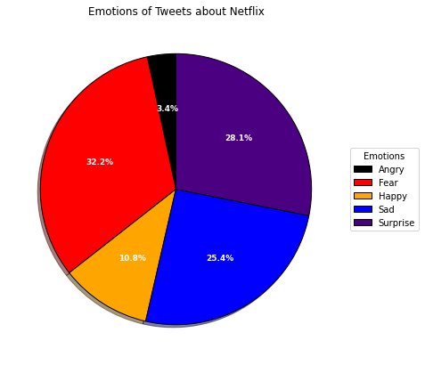

# Analyzing Sentiment about Netflix based on Tweets
## Objective
The goal of this project is to analyze the public's general sentiment towards Netflix. This is accomplished by scraping tweets from Twitter (or X) that include the word "Netflix," detecting the emotion behind the tweet using the [text2emotion](https://pypi.org/project/text2emotion/) library, summing the total sentiment behind all tweets, and visualizing the results in a pie chart.

## Usage Instructions
To run this project you will want to replace the parameters `<your-bearer-token>` and `<your-twitter-username>` with your own credentials. Your bearer token can be generated by setting up developer access on [developer.twitter.com](https://developer.twitter.com/en). 

For ease of use, I wrote a shell script called `tweet-analytics.sh` to run through all the steps chronologically. If you wish to run an individual step, you can copy and paste that step from this script to your command line.

#### Mac OS / Linux
To execute this script on Mac OS or Linux, run `chmod +x run_classifier.sh` once in this project's home directory to set the execution permissions. Then, it can be executed by running `./tweet-analytics.sh` or `sh tweet-analytics.sh` in this project's home directory.

#### Windows
If running on a Windows command line, this script can be executed by running `bash tweet-analytics.sh`.

## Results
My results from running this experiment are shown below.

## Note
With recent Twitter updates, scraping tweets may not be available with the free version of Twitter Developer.
